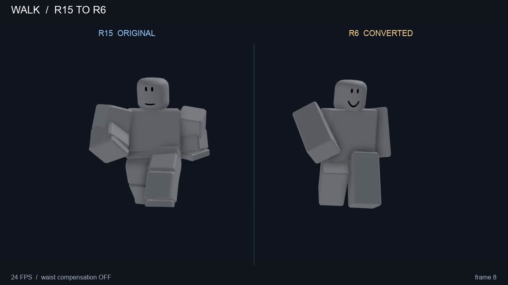
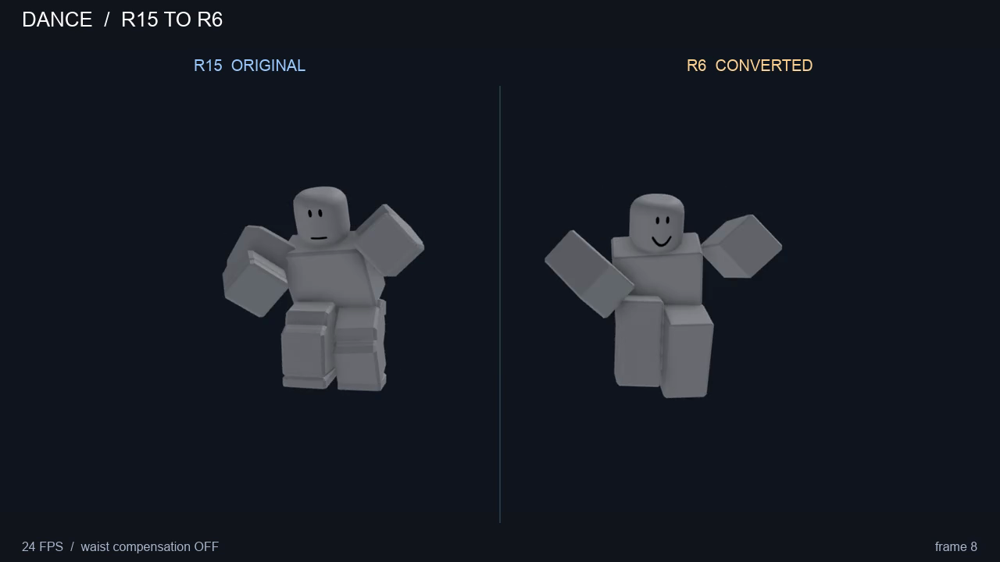
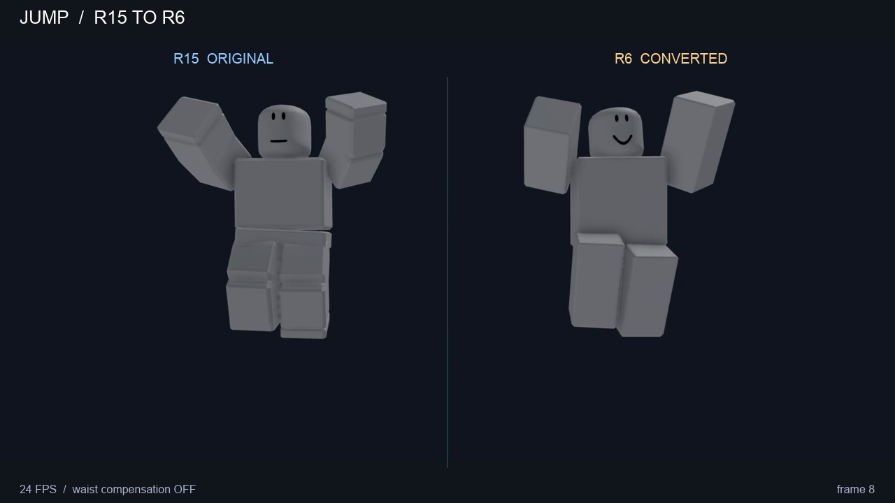

# Animation fixtures

Each R15 KeyframeSequence has a video showing the original on the left and its R6 conversion on the right. Both rigs play the same source time at the same scale. The camera stays fixed throughout each clip.

| Animation | Source fixture | Conversion video |
| --- | --- | --- |
| Walk | [KeyframeSequence](rbx_animate_walk.rbxm) | [MP4](videos/rbx_animate_walk.mp4) |
| Dance | [KeyframeSequence](rbx_animate_dance.rbxm) | [MP4](videos/rbx_animate_dance.mp4) |
| Jump | [KeyframeSequence](rbx_animate_jump.rbxm) | [MP4](videos/rbx_animate_jump.mp4) |

`r6_animate_idle1.rbxm` is a negative fixture: the converter must reject it as already R6, so it has no conversion video.

Run `mise run videos` from the repository root to regenerate all comparisons. Videos repeat each animation for at least six seconds and two cycles, including the non-looping jump. Waist compensation is off by default; `--counter-waist` regenerates with it enabled. [generation.json](videos/generation.json) records the settings and content hashes used for each video. Commit regenerated videos together with any fixture or converter changes.
